# EduSphere LMS

EduSphere is a full-stack Learning Management System (LMS) built to manage online courses, users, and learning progress. It allows students to enroll in courses, track their progress, and receive certificates, while instructors and admins can manage content and users.

---
## Screenshots

### Landing Pages

| Home Page                       | Features Section                | FAQ Section                     |
| ------------------------------- | ------------------------------- | ------------------------------- |
|  | 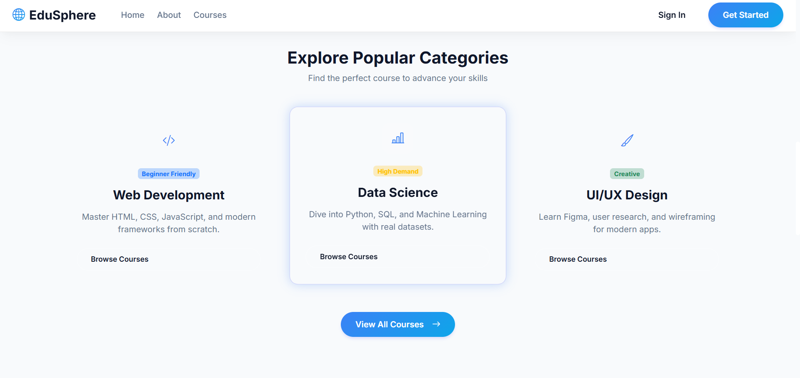 | 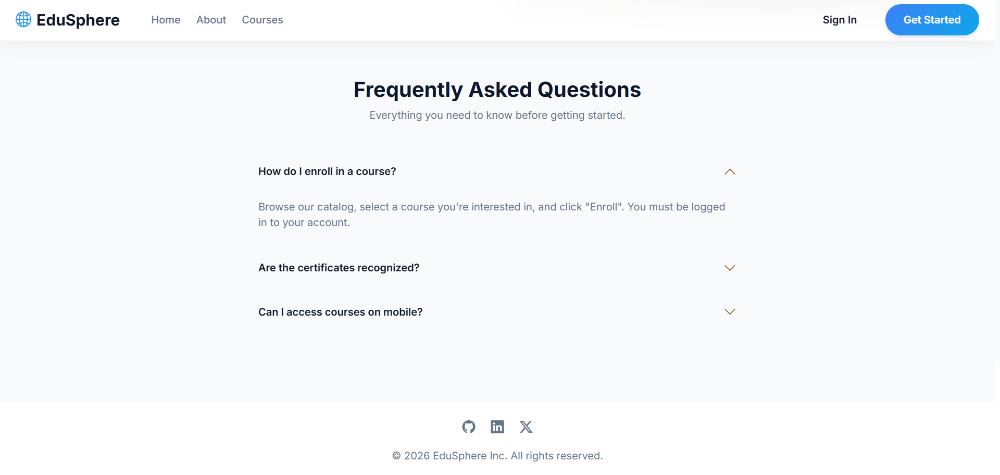 |

| Additional Section              |
| ------------------------------- |
|  |

---

### Authentication

| Login Page                     | Admin Login                     |
| ------------------------------ | ------------------------------- |
| 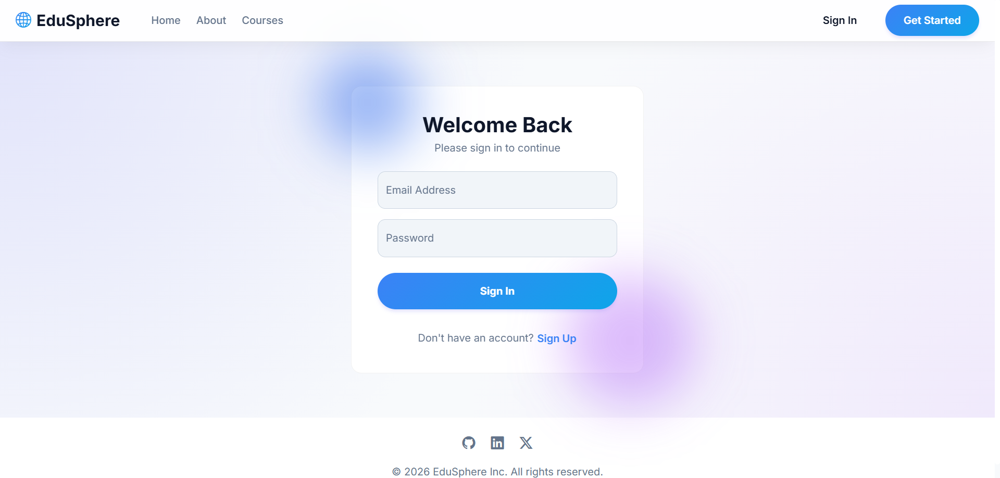 | 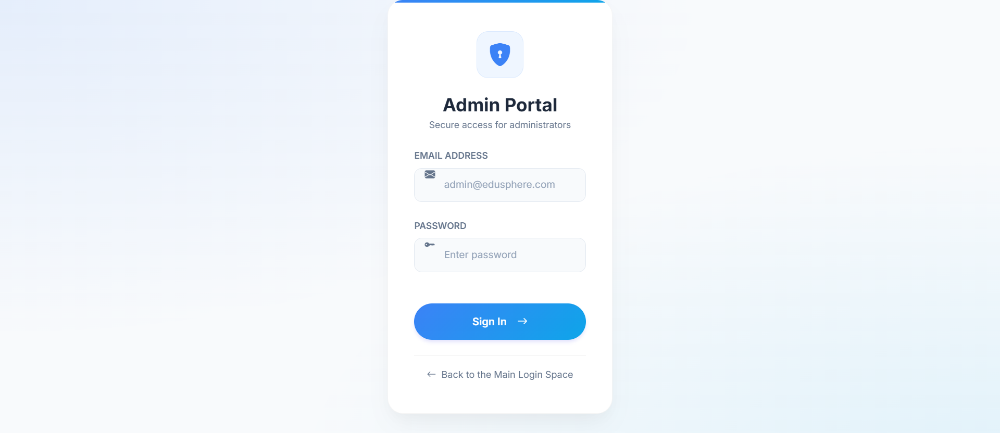 |

---

### Student Experience

| Dashboard                  | Course View                 | Profile                      |
| -------------------------- | --------------------------- | ---------------------------- |
| 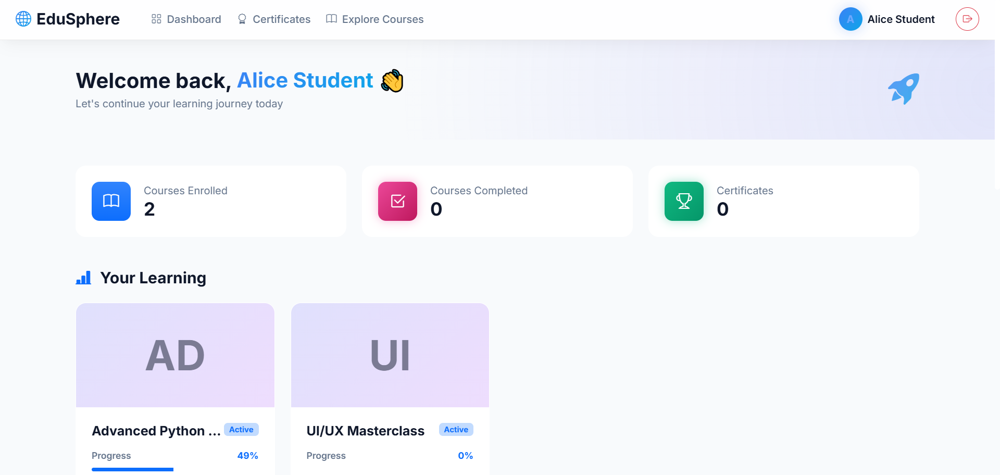 | 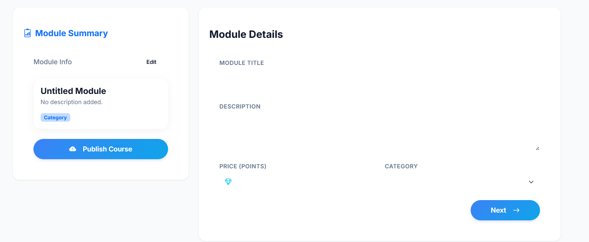 | 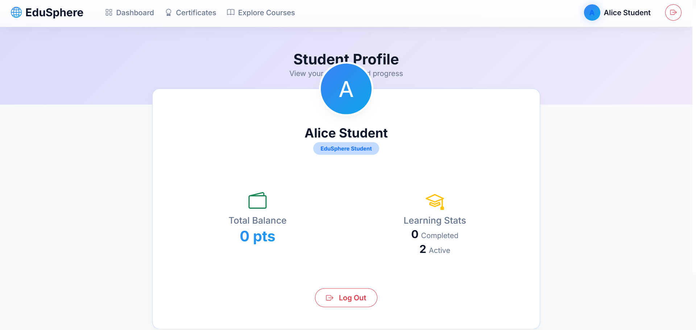 |

| Subscription / Plans       |
| -------------------------- |
| 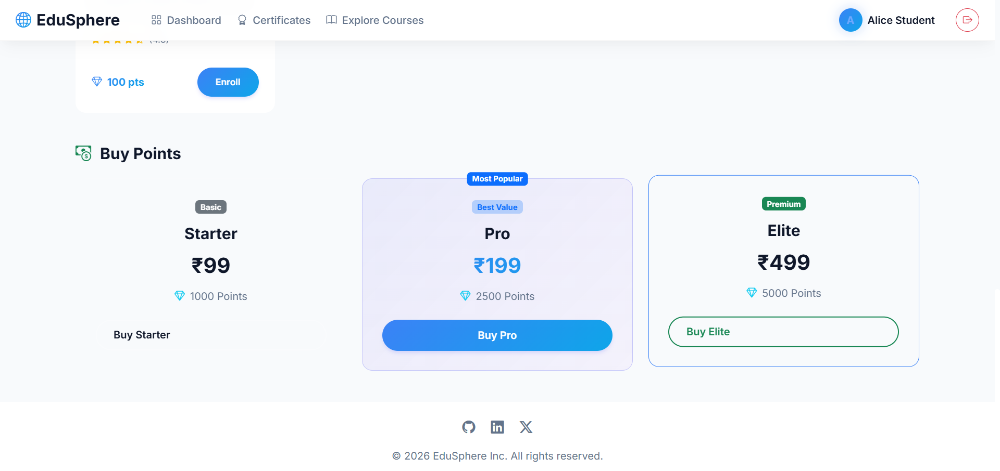 |

---

### Admin Panel

| Dashboard                        | Management Panel                 | User Management           |
| -------------------------------- | -------------------------------- | ------------------------- |
| 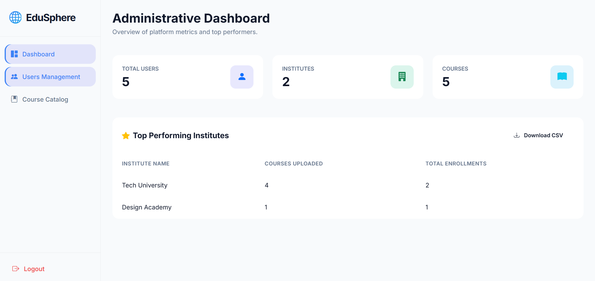 | 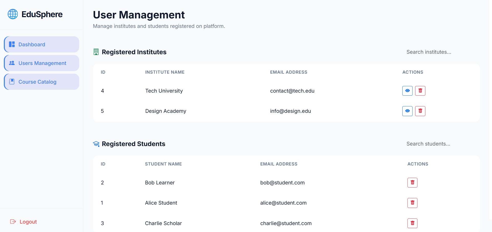 | 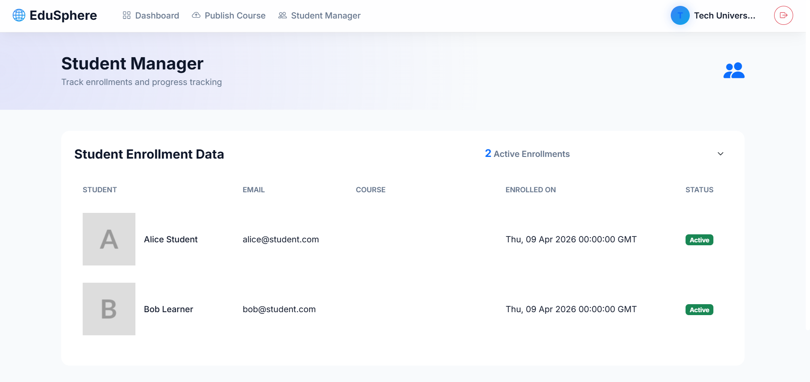 |

---

### Institute / Analytics

| Institute Dashboard              |
| -------------------------------- |
| 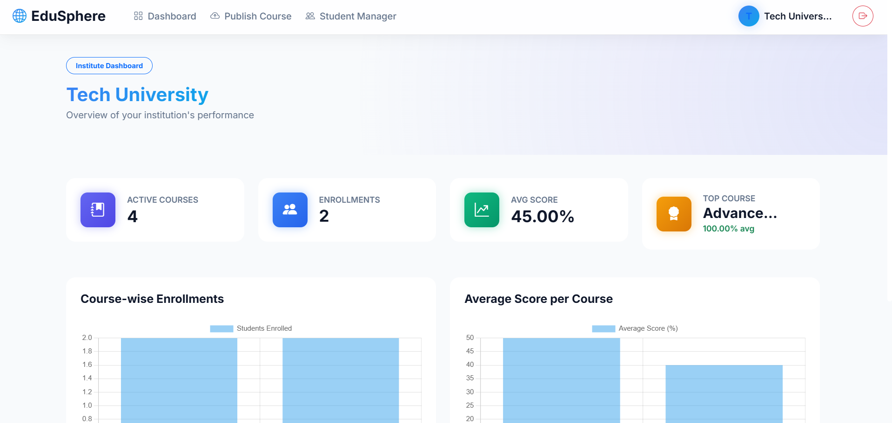 |

---

### Certificate

| Generated Certificate            |
| -------------------------------- |
| 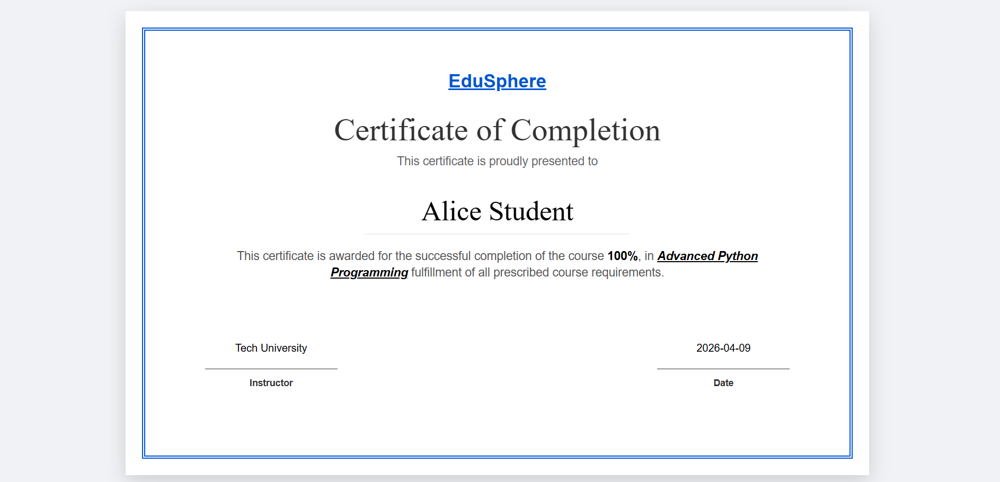 |


## Features

### Student

* Enroll in courses and access video content (YouTube integration)
* Track course progress and continue learning
* Attempt quizzes and get instant results
* Generate course completion certificates

### Instructor / Institute

* Create and manage courses with multiple modules
* View student enrollments and performance
* Secure login with OTP-based authentication

### Admin

* Manage users, courses, and institutes
* Monitor overall platform activity
* Export data (CSV)

---

## Tech Stack

* Backend: Python, Flask
* Database: PostgreSQL
* Frontend: HTML, CSS, JavaScript, Bootstrap
* Authentication: OTP-based email verification
* Security: Password hashing (Werkzeug), input validation

---

## Setup Instructions

### Prerequisites

* Python 3.10+
* PostgreSQL

### Installation

```bash
# Clone the repository
git clone https://github.com/JaivPatel07/Sem-3-Project.git
cd Sem-3-Project

# Install dependencies
pip install -r requirements.txt

# Setup environment variables
cp .env.example .env

# Initialize database
python init_db.py
python seed.py

# Run the application
python app.py
```

---

## Project Structure

```
Sem-3-Project/
│── static/
│   ├── css/
│   └── js/
│
│── templates/
│
│── app.py
│── init_db.py
│── seed.py
│── schema.sql
│── python_db_methods.py
│── myEmail.py
│── requirements.txt
```

---

## Security

* Passwords are securely hashed using Werkzeug
* OTP-based email verification system
* Session-based authentication
* Input validation to prevent invalid data

---
